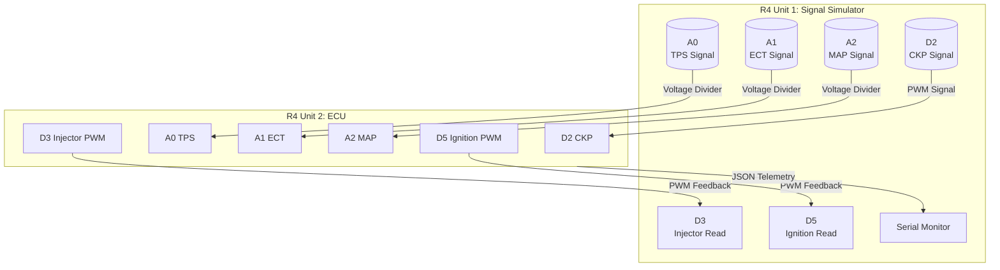

# SDTB Engine ECU

Arduino UNO R4 Minima-based Engine Control Unit for SDTB project.

## Features

| Feature | Description |
|---------|-------------|
| **RPM Sensing** | Interrupt-based crankshaft position sensor (36-1 trigger wheel) |
| **Speed-Density Fueling** | TPS + MAP based injection duty cycle |
| **Thermal Cutoff** | ECT-based overheat protection with hysteresis |
| **Cold Start Priming** | 1.5s fuel prime on startup |
| **RPM Ignition Advance** | Dynamic ignition timing based on RPM |
| **JSON Telemetry** | Serial output for HIL testing |

## Pinout

| Pin | Function | Type |
|-----|----------|------|
| D2 | CKP (Crankshaft Position) | Interrupt Input |
| A0 | TPS (Throttle Position) | Analog Input |
| A1 | ECT (Engine Coolant Temp) | Analog Input |
| A2 | MAP (Manifold Pressure) | Analog Input |
| D3 | Injector PWM | PWM Output |
| D5 | Ignition Coil PWM | PWM Output |

## Hardware Setup (Signal Simulation)

Two Arduino UNO R4 Minima units connected for HIL testing:



**Wiring Notes:**
- ECU D3 → Simulator D3 (Injector PWM)
- ECU D5 → Simulator D5 (Ignition PWM)
- Use voltage divider (5V→3.3V) if connecting directly

## Signal Generator Code (R4 Unit 1)

Upload this to the simulator R4:

```cpp
// Signal Simulator for ECU Testing
// Outputs: CKP pulses, TPS, ECT, MAP模拟电压
// Reads back: Injector PWM, Ignition PWM from ECU

const int CKP_OUT = 2;
const int TPS_OUT = A0;
const int ECT_OUT = A1;
const int MAP_OUT = A2;
const int INJ_READ = 3;   // Read ECU Injector PWM
const int IGN_READ = 5;  // Read ECU Ignition PWM

unsigned long lastTelemetry = 0;

void setup() {
  pinMode(CKP_OUT, OUTPUT);
  pinMode(INJ_READ, INPUT);
  pinMode(IGN_READ, INPUT);
  Serial.begin(115200);
}

void loop() {
  unsigned long now = millis();

  // Generate CKP pulses (simulate ~3000 RPM with 36-1 wheel)
  digitalWrite(CKP_OUT, HIGH);
  delayMicroseconds(10);
  digitalWrite(CKP_OUT, LOW);
  delayMicroseconds(544);

  // Read ECU PWM outputs
  int injectorDuty = analogRead(INJ_READ);
  int ignitionDuty = analogRead(IGN_READ);

  // Telemetry output
  if (now - lastTelemetry >= 100) {
    Serial.print("{\"sim\":{\"inj\":");
    Serial.print(injectorDuty);
    Serial.print(",\"ign\":");
    Serial.print(ignitionDuty);
    Serial.println("}}");
    lastTelemetry = now;
  }
}
```

## Telemetry Output

```json
{"rpm":3000,"tps":512,"kPa":50,"ect":256,"cutoff":false}
```

## Build

```bash
# Compile for Arduino UNO R4 Minima
arduino-cli compile --fqbn arduino:mbed_rp2040:uno_r4_minima
```

## Phase History

- **Phase 1**: Basic RPM + throttle injection + thermal cutoff
- **Phase 2.1**: Added RPM clamping, cold start priming, MAP sensor
- **Phase 2.2**: Non-blocking telemetry, RPM-based ignition advance